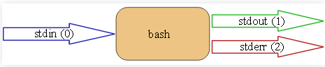

# Linux Syllabus

# Hoofdstuk 1: Intro & user management
## Permissies
- = toegangsrechten voor bestanden en directories
- instelbaar op niveau van:
  - u: gebruiker, **u**ser
  - g: groep, **g**roup
  - o: andere gebruikers, **o**thers
  - a: iedereen, **a**ll
- soorten permissies
  - r: lezen, **r**ead
  - w: schrijven, **w**rite
  - x: e**x**ecute
    - bestand, uitvoeren als commando
    - directory: toegang met cd
### Instellen met symbolische notatie
- permissies instellen met `chmod`, symbolische notatie

### Instellen met octale notatie
```bash
u      g      o
r w x  r - x  - - -
1 1 1  1 0 1  0 0 0
4+2+1  4+0+1  0+0+0
  7      5      0
``` 
- voorbeelden
  ```bash
    chmod 755 script
    chmod 600 file
    chmod 644 file
    chmod 775 dir
  ```
- **Merk op!**
  - sommige permissie-combinaties komen nooit voor in de praktijk, bv. 1,2,3
  - directories altijd lezen(r) en execute(x) *samen* toekennen of afnemen
  - permissies owner => group => others
  - root negeert bestandpermissies
  - tip octale permissies opvragen: `stat -c %a BESTAND`

## Meer Permissies
### Permissies van nieuwe bestanden
- `umask` bepaalt permissies van bestand/directory bij aanmaken
- huidige waarde opvragen: `umask` zonder opties
- opgegeven in octale notatie
  - enkel 0,2 en 7 zijn zinvol
- welke permissies *afnemen*
  - bestand krijgt nooit execute-permissie

### Speciale permissies: *SUID*
- set user ID (SUID)
- op bestanden met execute-permissies
- tijdens uitvoeren krijgt de gebruiker de rechten van de eigenaar van het bestand
- symbolisch: `u+s`
- octaal: 4

### Speciale permissies: *SGID*
- set group ID (SGID)
- op bestanden met execute-permissies
- tijdens uitvoeren krijgt de gebruiker de rechten van de groep van het bestand
- symbolisch: `g+s`
- octaal: 2

### Speciale permissies: *restricted deletion*
- restricted deletion, of sticky bit
- toegepast op directories
- een bestand mag in zo'n directory enkel door de eigenaar verwijderd worden
- symbolisch: `+t`
- octaal: 1

## Beheer van gebruikers
### Commando's voor gebruikers en groepen
- gebruikers: `useradd`,`usermod`, `userdel`
- groepen: `groupadd`, `groupmod`, `groupdel`
- info opvragen: `who`, `groups`, `id`

### Configuratiebestanden
- gebruikers: `/etc/passwd`, `/etc/shadow`
- groepen: `/etc/group`

### primaire vs aanvullende groepen
- primaire groep: 4e veld van `/etc/passwd` (group ID)
- aanvullende groepen: in `/etc/group`, gebruiker staat niet vermeld in de primaire groep

### root of administrator
- root: oorspronkelijk de enige administrator van het systeem
- sudo: kan root rechten verlenen aan een gebruiker
  - voor een bepaald commando
  - voor alle commando's
- `/etc/sudoers`, vertelt je wie er precies 'sudo'-rechten heeft
  - group `sudo` in Ubuntu/Debian
  - group `wheel` in Fedora/RedHat

# Hoofdstuk 2: Combining commands into scripts

## Streams, pipes en redirects



- stdin = standaard input.
- stdout = standaard output
- stderr = standaard error
- normaal gedrag:
    - standaard input: invoer toetsenbord
    - standard output/error: afdrukken op scherm(console)

### Output redirection

‘>’

### noclobber option

zorgt ervoor dat er files gedelete worden door het gebruik van ‘>’

- kan overzet worden door ‘>|’

### >> append

‘>>’ gebruiken om nog meer output aan een file toe te voegen.

### Error redirection

‘2>’

- kan gemakkelijk zijn om te voorkomen dat error berichten je scherm vol clutteren.
- Om stdout en stderr naar dezelfde file te brengen: 2>&1

### Input redirection

‘<’

## Filters

- commando dat:
    - leest van stdin of bestand
    - tekst transformeert
    - wegshcrijft naar stdout
- belangrijke filter-commando’s


## Intro Bash scripts

### Script schrijven

1. bestand aanmaken (script.sh)
2. bestand uitvoerbaar maken `chmod +x script.sh`
3. uitvoeren `./script.sh`

### de  "shebang"

- eerste regel van een script
- begint met #!
- absoluut pad naar de interpreter voor het script
    - #! /usr/bin/python
    - #! /usr/bin/ruby
    - #! /usr/bin/env
        - = zoek in ${PATH} naar bash

### Tekst afdrukken

- gebruik van echo

```bash
var="wordl"

echo "Hello ${var}" #binnen " " wordt substitutie toegepast
echo 'Hello ${var}' #binnen ' ' wordt geen substitutie toegepast
```

### Variabelen

- bash-variabelen zijn (meestal) strings
- declaratie: `variabele=waarde`
    - zonder spatie rond =
- waarde opvragen: `${variabele}`
- gebruik in strings ⇒ met dubbele aanhalingstekens

### codestijl

- accolades gebruiken!!!
- vermijd splitsen van woorden

### onbestaande variabelen opvragen

- onbestaande variabelen == lege string
    - oorzaak van vele fouten in shell-scripts
    - `set -o nounset` ⇒ script afbreken

### zichtbaarheid van variabelen (scope)

- enkel binnen zelfde "shell", niet binnen "subshells"
- script oproepen ⇒ creëert een subshell
- maak "globale", omgevingsvariabelen met `export`

```bash
export VARIABLE1=value

VARIABLE2=value
export VARIABLE2
```

### naamgeving

- lokale variabelen ⇒ kleine letters
- omgevingsvariabelen ⇒ hoofdletters

## vi(m) vs nano (xtra)

### bestand aanmaken

- met Vi/Vim: `vim bestand.txt`
- met Nano: `nano bestand.txt`
- leeg bestand: `touch bestand.txt`

### andere commando’s

- normal mode -> insert mode: `i`
- IM -> NM : <Esc>
- Opslaan: `w`
- Opslaan en afsluiten: `wq`
- Afsluiten zonder opslaan: `q!`

# Hoofdstuk 3: Software installatie: DHCP server

## Software-installatie

### Wat?

- Distributie = kernel + collectie applicaties
- Applicatiesoftware wordt gecompileerd voor het OS
- Applicaties worden ontwikkeld, al of niet met librabies

### Waar komt software vandaan?

- Package =
    - Gecompileerde software
    - Bijhorende bestanden (configuratie, man,…)
    - Info over waar bestanden terecht komen
    - Afhankelijkheden van libraries of andere software (eventueel)
    - = dependency

### Debian vs Red Hat

- Verschillen:
    - De manier waarop software wordt beheerd
        - Debian: .deb packages
        - Red Hat: .rpm packages

Debian dpkg

- Tool die een .deb package installeert op een systeem

### Dependency

- Software gebouwd boven op andere software
- 3 manieren:
    - Download een .deb package (manueel)
    - Installeer met dpkg
        - `dpkg -i <package_name>.deb`
    - los eventuele depencies manueel op
- overzicht van geïnstalleerde packages:
    - `dpkg -l`

Debian apt

- APT = Advanced Package Tool
- Stappen:
    - Zoek een package op de (aanvaarde) repository servers
    - download de .deb package (automatisch)
    - controlleer depencencies, download eventuele extra packages
    - installeert (achterliggend) met dpkg


- automatisering:
    - bijwerken van info op de repo servers


- bijwerken van alle packages op systeem


- bijwerken van een enkele pack


# Hoofdstuk 4: Installatie van een webserver, scripting

## Webserver installatie

### Doelstelling

LAMP-stack = Linux + Apache + MariaDB + PHP

## Scripting (vervolg)

### Positionele parameters

 

- ${0} ⇒ naam script
- ${1}, ${2}, ... ⇒ eerste, tweede,... argument
- ${10} ⇒ tiende argument (accolades verplicht)
- ${*} ⇒ alle argumenten
- ${@} ⇒ alle argumenten
- ${#} ⇒ aantal positionele argumenten

### shift

- `shift` ⇒ schuift positionele parameters op naar links

### positionele parameter instellen

```bash
set par1 par2 par3
echo "${1}"  #  => par1
echo "${2}"  #  => par2
echo "${3}"  #  => par3
echo "${4}"  #  =>       (lege string)
```

### Exit-status

- elk commando heeft een exit-status, numerieke waarde
    - opvragen met echo "$?"
    - 0 ⇒ commando geslaagd, logische true
    - 1 - 255 ⇒ commando gefaald, logische false
- logische operatoren in Bash zijn gebaseerd op exit-status
- booleaanse veriabelen bestaan niet

### if

```bash
if EXPR
then
  # ...
elif EXPR
  # ...
else
  # ...
fi
```

### while-lus

```bash
while EXPR; do
  # ...
done
```

### until-lus

```bash
until EXPR; do
  # ...
done
```

### while lus met teller

```bash
counter=0

while [ "${counter}" -le '10' ]; do
  echo "${counter}"
  counter=$((counter + 1))
done
```

⇒ $((...)) is arithmetic expansion

### for-lus

```bash
for ITEM in LIST; do
  # ...
done
```

```bash
for file in *.md; do
  printf 'Processing file %s\n' "${file}"
  # ...
done
```

### for-lus met teller

```bash
for ((i=0; i<=10; i++)); do
  echo "${i}"
done
```

### itereren over positionele parameters (while)

```bash
while [ "$#" -gt 0 ]; do
  printf 'Arg: %s\n' "${1}"
  # ...
  shift
done
```

### itereren over positionele parameters (for)

```bash
for arg in "${@}"; do
  printf 'Arg: %s\n' "${arg}"
  # ...
done
```

# Hoofdstuk 5: Hardening van een webserver

## Firewall-configuratie

### firewall-instellingen aanpassen

```bash
sudo systemctl status firewalld  # is de firewall actief?
sudo firewall-cmd --list-all     # = toon firewall-regels
sudo firewall-cmd --add-service http --permanent
sudo firewall-cmd --add-service https --permanent
sudo firewall-cmd --reload
```

### Zones

- zone = lijst van regels voor een specifieke situatie
- netwerkkaarten worden toegkend aan een zone
- vooral nuttig voor laptop
    - server: public zone is meestal voldoende

### peristentie wijzigingen

- `--permanent` optie wordt niet onmiddelijk toegepast!
- 2 werkwijzen:
    - commando 2x uitvoeren: 1x zonder, 1x met `--permanent`
    - commando enkel met `--permanent` uitvoeren, firewall herladen

## Security Enhanced Linux

### SELinux

- SELinux: Security Enhanced Linux
    - "Mandatory Access Control"
    - ingebouwd in de linux kernel
    - vooral in RedHat
- AppArmor:
    - equivalent op Debian/Ubuntu

### 3 soorten SELinux-instellingen

- booleans: `getsebool` , `setsebool`
- contexts, labels: `ls -Z` ,`chcon` , `restorecon`
- policy modules: `sepolicy`

# Hoofdstuk 6: Automatiseren webserverinstallatie

## Scripting (vervolg)

### Fouten opsporen

- begin met minimaal script
- werk altijd stap voor stap
    - iteratieve toevoegingen
- test voortdurend het resultaat van elke wijziging
- hou minstens 2 vensters open naast elkaar
    - editor
    - terminal voor testen
- syntax check: `bash -n script.sh`
- ShellCheck: `shellcheck script.sh`
    - gebruik editor-plugin waar mogelijk
- druk veel info af (`printf`of `echo`)
- debug-mode:
    - `bash -x script.sh`
    - in het script: `set -x`en `set +x`

### fouten voorkomen

- begin elk script met

```bash
set -o errexit   # abort on nonzero exitstatus
set -o nounset   # abort on unbound variable
set -o pipefail  # don't hide errors within pipes
```

### booleans in bash

- in Bash bestaan er **geen booleaanse variabelen**
- er bestaan wel gelijknamige commando's `true` en `false`
- booleanse waarden zijn gebaseerd op exit-status van het proces

### logische operatoren

```bash
if COMMANDO; then
  # A
else
  # B
fi
```

- A-blok ⇒ wordt uitgevoerd als exit-status van COMMANDO 0 is (geslaagd, TRUE)
- B-blok ⇒ wordt uitgevoerd als exit-status van COMMANDO verschillend is van 0 (gefaald, FALSE)

### Toepassing

- maak gebruiker ${user} aan als die nog niet bestaat

```bash
if ! getent passwd "${user}" > /dev/null 2>&1; then
  echo "Adding user ${user}"
  adduser "${user}"
else
  echo "User ${user} already exists"
fi
```

### Operatoren && en | |

- `command1 && command2`
    - command2 wordt enkel maar uitgevoerd als command1 succesvol was (exit 0)
- `command1 || command2`
    - command2 wordt enkel uitgevoerd als command1 **niet** succesvol was (exit ≠ 0)

### Het commando test

- evalueren van logische expressies
- geeft geschikte exit-status
    - 0 = TRUE
    - 1 = FALSE
- alias voor test is [
    - [ is een commando, geen "haakje" in de traditionele betekenis
    - spatie voor en na!

## Automatiseren webserverinstallatie

### De kracht van automatisering

- installeren van een server is terugkerende taak
- moet snel en foutloos kunnen gebeuren!
    - 1x, 10x, 100x, ....
- ⇒ automatiseren is een noodzaak

### Kwaliteitsbewaking bij serverinstallatie

Opbouw in de opleiding:

- gedetailleerde procedurehandleiding
    - SELab, Linux, System Engineering Project
- Script voor automatisering
    - Linux, System Engineering Project
- Configuration Management
    - Infrastructure Automation

### Tool: vagrant

[Vagrant by HashiCorp](https://www.vagrantup.com)

- command-line applicatie
- automatiseert aanmaken en configureren van (VirtualBox) VMs
- draait op Linux, Windows, MacOS

### Waarom Vagrant gebruiken?

- snel nieuwe VMs aanmaken
- reproduceerbaar!
    - enkel code, geen .ova van +4GB
    - overdraagbaar naar ander platform
- aantal VMs onder controle houden

### overzicht repo

- Vagrantfile: configuratiebestand van Vagrant
- vagrant-hosts.yml: overzicht VMs in de opstelling
    - incl. eigenschappen zoals IP-adres
- provisioning/: installatiescripts voor VMs

### idempotentie

- wiskundige eigenschap van een operatie
- een operatie herhaald uitovern verandert het resultaat niet meer na de 1e keer
- server installatie: handeling enkel uigevoerd indien nodig:
    - sommige linux commando's zijn al idempotent (vb. `dnf install`)
    - sommige commando's zijn dat niet (vb. `useradd`)
    - ⇒ test of het nodig is bepaalde taak uit te voeren!

# Hoofdstuk 7: Complexe scripts, cronjobs

## Complexere scripts

### Communicatie script/omgeving

- informatie uitwisselen tussen script en omgeving
    - I/O: stdin, stdout, stderr
    - Positionele parameters: $1, $2, enz
    - Exit-status (0-255)
    - omgevingvariabelen

### Functies in Bash

```bash
functie_naam() {
	#code
}
```

- een functie gedraagt zich als een script
    - oproepen: `functie_naam arg1 arg2 arg3`
    - positionele parameters: ${1},${2}, enz
    - `return STAT` ipv `exit`

### Scope variabelen bij functies: global

### Scope variabelen bij functies - local

### Functies in Bash: voorbeeld

```bash
# Usage: copy_iso_to_usb ISO_FILE DEVICE
# Copy an ISO file to a USB device, showing progress with pv (pipe viewer)
# e.g. copy_iso_to_usb FedoraWorkstation.iso /dev/sdc
copy_iso_to_usb() {
  local iso="${1}"
  local destination="${2}"
  local iso_size

  iso_size=$(stat -c '%s' "${iso}")

  printf "Copying %s (%'dB) to %s\n" \
    "${iso}" "${iso_size}" "${destination}"

  dd if="${iso}" \
    | pv --size "${iso_size}" \
    | sudo dd of="${destination}"
}
```

### Case (1)

```bash
case EXPR in
  PATROON1)
    # ...
    ;;
  PATROON2)
    # ...
    ;;
  *)
    # ...
    ;;
esac
```

### Case (2)

```bash
option="${1}"

case "${option}" in
  -h|--help|-?)
    usage
    exit 0
    ;;
  -v|--verbose)
    verbose=y
    shift
    ;;
  *)
    printf 'Unrecognized option: %s\n' "${option}"
    usage
    exit 1
    ;;
esac
```

### Tips

- zet positionele parameters om in beschrijvende namen
- maak lijnen te lang (gebruik \ op het einde van een regel)
- gebruik "lange" opties: maakt script leesbaarder
- gebruik lokale variabelen in functies
- deel script op in (herbruikbare) functies

## Plannen van systeembeheertaken: cronjobs

### Processen op de achtergrond

```bash
$ vi test.txt
Ctrl+Z

[1]+  Stopped                 gvim -v test.txt
$ bg
[1]+ sleep 30 &

$ find / -type f > all-files.txt 2>&1 &
[2] 4321
```

- `Ctrl+Z` zet de uitvoer van een proces stil (nog niet afgesloten)
- `bg` start het proces terug op, maar in de achtergrond
- `&` op het einde van een regel start proces op de achtergrond = combinatie van `ctrl+Z` en `bg`

### Achtergrondprocessen beheren

| commando | betekenis |
| --- | --- |
| jobs | lijst van achtergrondprocessen |
| jobs -l | idem, toon ook Process ID (PID) |
| fg NUM | Breng proces op voorgrond |
| bg NUM | herstart stilgelegd proces op achtergrond |

### Processen eenmalig plannen

### Overzicht

| Commando | Betekenis |
| --- | --- |
| at | Voer commando's uit op specifiek tijdstip |
| atq | geeft lijst van geplande taken |
| atrm NUM | verwijder taak met id NUM |
| batch | voer taak uit wanneer systeem minder belast is |

### Processen herhaald plannen: cron

- bekijk `/etc/crontab`
- bevat taken die regelmatig gepland worden:
    - tijdsaanduiding
    - commando
- crontab per gebruiker
    - tonen: `crontab -l`
    - bewerken: `crontab -e`

### Tijdsaanduiding

| Veld | Beschrijving | Waarden |
| --- | --- | --- |
| MIN | Minuten | 0-59 |
| HOUR | Uren | 0-23 |
| DOM | Dag van de maand | 1-31 |
| MON | Maand | 1-12 |
| DOW | Dag van de week | 0-7 |
| CMD | Commando |  |

### Voorbeelden

```bash
# use /bin/sh to run commands, no matter what /etc/passwd says
SHELL=/bin/sh
# mail any output to `paul', no matter whose crontab this is
MAILTO=paul
# Set time zone
CRON_TZ=Japan
# run five minutes after midnight, every day
5 0 * * *       $HOME/bin/daily.job >> $HOME/tmp/out 2>&1
# run at 2:15pm on the first of every month -- output mailed to paul
15 14 1 * *     $HOME/bin/monthly
# run at 10 pm on weekdays, annoy Joe
0 22 * * 1-5    mail -s "It's 10pm" joe%Joe,%%Where are your kids?%
23 0-23/2 * * * echo "run 23 minutes after midn, 2am, 4am ..., everyday"
5 4 * * sun     echo "run at 5 after 4 every sunday"
```

# Hoofdstuk 8: Troubleshooting, SSH-configuratie
## Network Access Layer
- bare metal:
  - test de kabels
  - check de switch/NIC LEDs
- VM : 
  - check virtual netwerk adapter type en instellingen
- `ip link`

## Internet Layer
### Checklist: Internet Layer: Lokale netwerk configuratie
- de lokale netwerk configuratie bekijken
  - ip adres: `ip a`
  - default gateway: `ip r`
  - DNS Service: `/etc/resolv.conf`
- meest voorkomende fouten (DHCP)
  - geen ip adres:
    - DHCP is onbereikbaar
    - DHCP geeft geen ip adres
  - 169.254.x.x
    - geen DHCP offer, een "link-local" adres
  - bekijk log: `sudo journalctl -f`
- mees voorkomende fouten (fixed ip)
  - unexpected subnet
    - check config
  - correct IP, "network unreachable"
    - check network mask
- DNS Server: /etc/resolv.conf
  - nameserver option aanwezig?
  - expected IP?
### Checklist: Internet Layer: Checking routing within the LAN
1. ping tussen de hosts
2. ping default GW/DNS
3. query DNS(dig, nslookup, getent)

- LAN connectiviteit: ping
  - GUI-VM -> VM: `ping 192.168.76.72`
  - VM --> GUI-VM: `ping 192.168.76.101`
  - VM -> NAT-GW: `ping 10.0.2.2`
  - VM -> NAT-DNS: `ping 10.0.2.3` 
- DNS
  - `dig icanhazip.com`
  - `nslookup icanhazip.com`
  - `getent ahosts icanhazip.com`

## Transport Layer
### Service running?
- `sudo systemctl status SERVICE`
- active (running) vs inactive (dead)
  - `sudo systemctl start httpd`
  - fail? bekijk Application Layer
- start at boot: enabled vs disabled
  - `systemctl enable httpd`

### Firewall settings
`sudo firewall-cmd --list-all`

- 
### Correcte poorten/interfaces?

## Application Layer
- Checklist:
  - check de logs
  - valideer config file syntax
  - gebruikt client tools
    - curl, smbclient(Samba), dig (DNS), etc.
    - Netcat (ncat, nc)

## SELinux troubleshooting
- Mandatory Access Control in de Linux Kernel
- instellingen
  - booleans
  - contexts, labels
  - policy modules
### Check file context
### Check booleans  

# Hoofdstuk 9: Mount
## Pre knowledge
### Disk Devices
- sate disk devices
### Disk partitions
- every disk:
  - maximum 4 primary/vergrote partities
  - 1 vergrote partitie kan meerdere logische (sub)partities hebben
  | Partitie Type | benaming  |
  | :---          | :---      |
  | Primaire (max 4)  | 1-4   |
  | Extended (max 1)  | 1-4   |
  | logical           | 5-    |

### fdisk
- toont en verander partities van een disk
```bash
$ sudo fdisk -l 
Disk /dev/sda: 64 GiB, 68719476736 bytes, 134217728 sectors
[...]

Device     Boot   Start       End   Sectors  Size Id Type
/dev/sda1          2048   4501503   4499456  2.1G 82 Linux swap / Solaris
/dev/sda2  *    4501504 134217727 129716224 61.9G 83 Linux
```

### File systems
- ext2
- ext3: met journaling
- ext4: laatste versie, met journaling
- xfs
- andere file systems
  - vfat
  - ntfs
  - iso9660

## Mount
### Manual mounting
- mount = maakt een partitie die beschikbaar is op de file tree
1. maak een mount punt ~ een mount directory
  `sudo mkdir /mnt/newmountpoint`
2. verbind de partitie aan het mount punt
  `sudo mount -t ext3 /dev/sdb3 /mnt/newmountpoint`

### Permanent mounts
- partities worden gemount tijdens boot in: `/etc/fstab`

### Mount options
- ro: read-only
- rw: read-write
- remount:

## UUID
### UUID def
- UUID = Universal Unique Identifier
  - 128 bits
  - gegenereerd tijdens het formatten
- lookup UUID: `sudo tune2fs -l /dev/sda2 | grep UUID
# Hoofdstuk 10: DNS met BIND
## DNS-server met BIND
## DNS
- vertaling van hostnaam naar IP in een tekstbestand
- DNS query = opzoeking in dat tekstbestand
- queries kunnen over het netwerk gestuurd worden

## Interactie met DNS
## BIND
- Berkeley Internet Name Domain
  - implementatie van het DNS protocol
  - meest gebruikte
  - de facto standaard op Unix-achtige systemen
### Installatie op Enterprise Linux
- package: bind
- configuratie: /etc/named*
- zonebestanden, enz: /var/named/
- hoofdconfiguratiebestande: /etc/named.conf
- belangrijkste opties:
  - listen-on: poort nummer + netwerk interfaces
    - any;
    - 127.0.0.0/8; 192.168.76.0/24
  - allow-query: welke hosts mogen queries sturen?
  - recursion: recursieve queries toelaten
    - zou no moeten zijn op een authoritative name server

# Hoofdstuk 10: DNS met BIND
## DNS
### Wat is DNS?
- vertaling van hostnaam naar IP adres in een tekstbestand
- DNS query = de opzoeking in dat tekstbestand
- queries kunne over het netwerk gestuurd worden

### Root DNS Server
- 12 root servers: [a-m].root-servers.net
- verschillende instanties per root server
  - totaal: 1000+
- instanties van een root server delen hun IP adres
  - routers sturen trafiek naar dichtsbijzijnde instantie

### Types van DNS servers
- Authoritative: "bron van waarheid" voor een zone
  - zonebestand
- Forwarding / caching: stuurt requests door naar andere servers
- Primary/Secondary: voor "high availability"
  - enkel primaire heeft zonebestand
  - secundaire vraagt regelmatig "zone transfer"

### Best practives in productie
- authoritative-only
  - caching & authoritative niet mengen
- DNS only
  - geen andere services op die machine
- een typische AD DC overtreedt beide regels

## Interactie met DNS
### nslookup
- stuur vraag naar de DNS-server

## BIND
### Berkely Internet Name Domain
- implementatie van het DNS protocol
- meest gebruikte
- de facto standaard op Unix-achtige systemen

### Installatie op Enterprise Linux
- package: bind
- configuratie: `/etc/named*`
- zonebestaden, enz: `/var/named/`

### Hoofdconfiguratiebestand
- `/etc/named.conf`
- belangrijkste opties:
  - listen-on: poort nummer + netwerk interfaces
    - any;
    - 127.0.0.0/8; 192.168.76.0/24
  - allow-query: welke hosts mogen queries sturen
  - recursion: recursieve queries toelaten
    - zou no moeten zijn op een authoritative name server

### Forwarding name server

### Types van Resource Records
- A: hostname --> IP
- AAAA: hostnaam --> IPv6
- PTR: IP --> hostname
- CNAME: alias
- SOA: start of authority
- NS: authoritative name server(s)
- MX: mail server
- SRV: service
- TXT: text record
- ...

### Start of Authority
```bash
@ IN SOA ns.example.com. hostmaster.example.com. (
  21120117 1D 1H 1W 1D)
```

- srv.example.com.: primaire DNS-server
- hostmaster.example.com.: email adres van de sysadmin
- 21120120: serial
  - let op secundaire servers zullen alleen update uitvoeren als serial verhoogd is
- timeouts
  - 1D: wanneer zal secundaire ns proberne de zone te synchorniseren
  - 1H: tijd tussen update-pogingen
  - 1W: wanneer zijn zonegegevens niet langer "authoritative" (enkel op secondaire)
  - 1D: hoe lang kan een NAME ERROR resultaat gecached worden
- shortcuts
  - $ORIGIN: domeinnaam
    - wordt toegevoegd aan alle namen die niet eindigen op .
    - @: wordt vervangen door waarde van $ORIGIN
  - $TTL: Time To Live (in seconden)
    - hoe lan gmag een record gecached worden
- (un)qualified domain names
  - Fully Qualified Domain Name (FQDN): eindigt met een punt
  - unqualified: zonder punt
    - $ORIGIN toegevoegd aan het einde
- tijdsaanduidingen
  - default = seconden
  - M = minuten
  - H = uren
  - D = dagen
  - W = weken

### Reverse lookup zone
- naam van een "reverse lookup zone"
  - neem het IP-adres: 192.0.2.0/24
  - laat het host-deel vallen: 192.0.2
  - keer volgorde om: 2.0.192
  - voeg in -addr.arpa. toe
  - **RESULTAAT**: 2.0.192.in-addr.arpa.
- root hint:
  - elke (forwarding) name server moet een lijst bijhouden van de root name servers
# RAID
## JBOD
= Just a Bunch Of Disks
## RAID 0
- Redundant Array of Independent Disks
- Stripping
  - beveiligd tegen single diefstal
  - niet beveiligd tegen het falen van hardware

## RAID 1
- mirroring (gebruik makend van 2 of meerdere disks)
  - veilig tegen het falen van hardware, maar volledig onveilig tegen diefstal
  - wanneer je Raid 1 gebruikt, gebruik volume encryptie (bitlocker)
  - Hot Spare disk = inactieve schijf die is uitgevallen, indien nodig kan een herbouwactie automatisch starten

## RAID 5
- Pariteit, heeft op ze minst 3 disks nodig
  - altijd 1 disk voor de capaciteit
- als 1 disk faalt, dan is het terug een RAID 0 operatie
- als Hot Spare geconfigueerd is, dan zal de rebuild actie onmiddelijk beginnen (= hierdoor een hogere lading op de overblijvende schijven)
- de huidige 'snelle' processoren maken RAID 5 even snel als RAID 1 of zelfs beter

## RAID 10
- minstens 4 harde schijven nodig, de capaciteit is gehalveerd
- het wordt vaak gebruikt door ondernemingen
- gelezen als dit RAID 1 (mirror) + RAID 0 (stripe)
## Soft- or Hardware RAID?
- de verschillen: waar nemen de berekening plaats?
  - hardware RAID: gedediceerde RAID chip (onboard or plugin card)
  - software RAID: gedeelde processor (meestal CPU)
- als je werkt met een DAS (Directly Attached Storage) systeem: dan heeft hardware RAID niet veel nut
  - de hoofd-CPU is krachtig genoeg voor de toegevoegde RAID functionaliteiten
  - het herstel van data is gemakkelijker met software RAID
- met een SAN / NAS is er niet echt een keuze:
  - door de dedicated RAID controller met propretaire algoritmes

## Het grote probleem met Hardware Raid
- de algoritmen en protocollen bedrijfseigen en daarom zeer moeilijk te herstellen in geval van gegevensverlies of forensisch onderzoek
- Elke (goede) RAID-controller dupliceert RAID-configuratie op de schijven voor hersteldoeleinden, echter: geen standaard
- RAID-controllers verouderen

## Software RAID
- voordelen:
  - kan gedaan worden door de OS zelf
    - Windows: Windows Dynamic Volumes of Storage Spaces
    - Linux: soft RAID of Logical Volumes
    - of door extra software (Starwind)
  - gemakkelijk te vergroten als het moet
  - herstelbaar
  - "gratis"
  - werkt onafhankelijk van de interface (IDE, SATA, SAS, SCSI,...)
  - snel (het maakt gebruik van snelle, moderne CPUs)
- nadelen:
  - een OS is niet gemakkelijk te installeren op software RAID
  - niet alle RAID levels zijn mogelijk
  - Hot Swap is niet altijd mogelijk te gebruiken (het hangt af van de configuratie van het interface protocol)